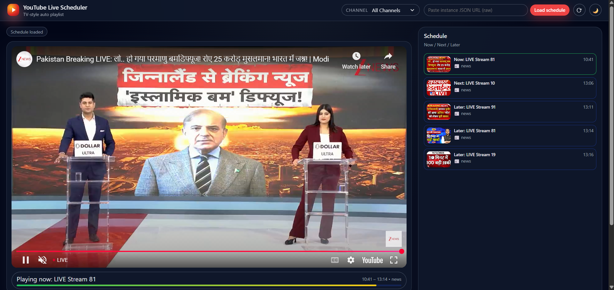
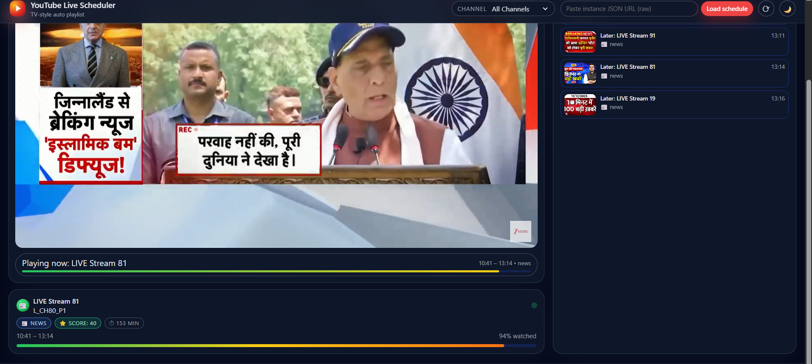

<table border="0">
 <tr>
    <td style="width:300px; vertical-align:middle; text-align:center;">
      
    </td>
    <td style="vertical-align:middle; padding-left:20px;">
      <h2><strong>Universiteti i Prishtinës</strong></h2>
      <h3>Fakulteti i Inxhinierisë Elektrike dhe Kompjuterike</h3>
      
Inxhinieri Kompjuterike dhe Softuerike – Programi Master

      
<strong>Profesor:</strong> Prof. Dr. Kadri Sylejmani

    </td>
 </tr>
</table>

#  Live YouTube Scheduler SPA  
SPA (Single Page Application) me **HTML, CSS dhe JavaScript**

## Përshkrimi i projektit
Ky projekt është zhvilluar si pjesë e lëndës **Algoritmet e Avancuara** në programin Master – Inxhinieri Kompjuterike dhe Softuerike.  
Aplikacioni paraqet një **Single Page Application (SPA)** i cili përdor JavaScript për të:

- Ngarkuar një orar transmetimesh nga një skedar JSON
- Shfaqur live video nga YouTube sipas orarit të përcaktuar
- Ndërruar automatikisht videon sipas kohës aktuale
- Filtruar videot sipas kanalit
- Simuluar një grilë televizive (“mini-guide”) brenda faqes
- Punuar plotësisht vetëm me **HTML, CSS dhe JavaScript vanilla**

Aplikacioni funksionon si një platformë TV Live ku videot e YouTube shfaqen në oraret e caktuara.

## Teknologjitë e përdorura

- **HTML5**
- **CSS3**
- **JavaScript (Vanilla)**
- **YouTube IFrame API (embed)**

## Funksionalitetet kryesore
- Parsimi i URL-ve YouTube dhe nxjerrja e Video ID
- Konvertimi i "minutes since midnight" në kohë reale
- Autoplay i videove sipas programacionit
- Ndryshimi dinamik i orarit pa rifreskim të faqes
- Filtrim i programeve sipas kanalit
- Interfaci SPA pa reload

##  Si të ekzekutohet projekti
1. Shkarko ose klono projektin:
- git clone repository-url

2. Hap **index.html** në browser.
3. Aplikacioni fillon automatikisht të ngarkojë orarin dhe videot.

##  Screenshots

##  Autorët
**Qëndresa Potoku**  
**Olta Pllana**  
**Erza Merovci**  

Inxhinieri Kompjuterike dhe Softuerike – Programi Master  
Universiteti i Prishtinës

---

